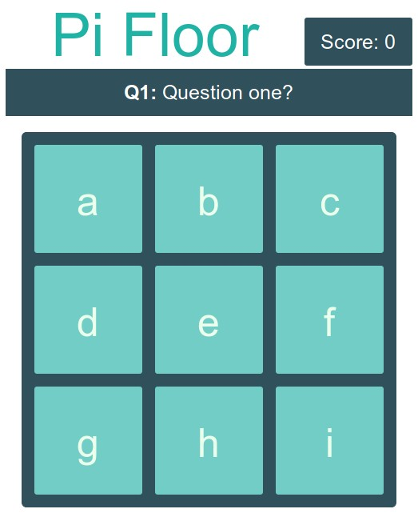

# PiFloor

[](https://zenodo.org/badge/latestdoi/131696857)


An Android Portable interactive floor with minimal setup, oriented towards child education

Pi Floor has three main modules
- Optical Character Recognition (OCR) provided by Google's vision API (soon MLKit)
- User Interface a website that's hosted on the phone used to display questions on a projection screen for example (or other device)
- Http and Web Socket server, for communication between user interface and application logic

## How it works

Detailed description about setup and usage checkout the [poster](Pi_Floor_Poster.pdf)

- Put the grid tiles on the floor, where each tiles contains an English word 
    
- Enter calibration mode and select correct text on the tiles that appear on the screen
    
- Enter game mode, start the web server
    
- Access the given URL in game mode
    
- Upload a file containing questions and answers on the following format
    
    
    ```
    Question?answer,choice0,choice1,choice2,choice3,...etc
    ```
- Students stand on the tile to mark the answer they want
    

# Thank You

- [AndroidAsync](https://github.com/koush/AndroidAsync)
- [Google's Android Vision Samples](https://github.com/googlesamples/android-vision) OCR Reader
- [Dagger](https://github.com/google/dagger)
- [RxKotlin](https://github.com/ReactiveX/RxKotlin)
